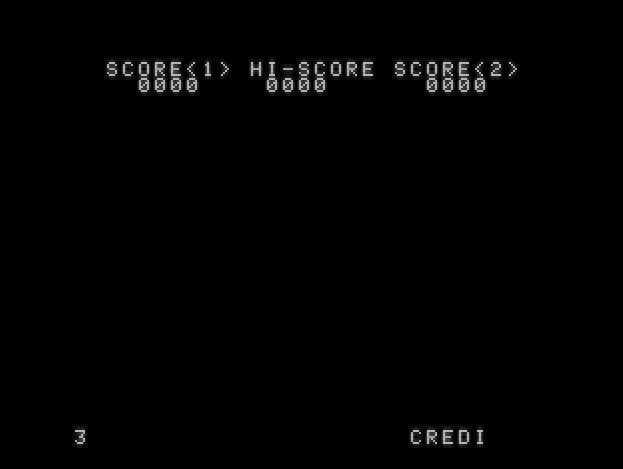

# Space Invaders

A faithful reproduction of the original arcade Space Invaders game, as released in 1978 by Taito. Implemented in Z80 machine code for the ZX Spectrum 48K. 

# Contents

* [Game](game) - The game code.
* [Building](game/docs/building.md) - How to build the project.
* [Running](game/docs/running.md) - How to run the project.
* [Playing](game/docs/playing.md) - How to play the come (controls).
* [Code Overview](game/docs/code.md) - An overview of the structure of the code base.
* [References](game/docs/references.md) - Links to various reference material I found useful in developing this project.
* [Screen-lookup-table](screen-lookup-table) - A utility to generate a lookup table to resolve coordinates to the corresponding screen memory address.
* [Shift-sprites](shift-sprites) - A utility to generate "pre-shifted" versions of sprite data for efficient rendering.

# Detail - Big and Small

Fundamentally the goal of the project is to reproduce Taito's arcade game precisely in both look and feel, running at full speed (50 fps on a UK ZX Spectrum) and flicker free.

Here are some of the details - some you will have noticed, others maybe not:

##  Big

* [x] Sprites and font are a pixel-perfect match to the originals.
* [x] There are 55 aliens - 5 rows of 11, and three different types of alien.
* [x] Overall layout - including strange spacing in places - is matched as closely as is possible.
* [x] The game runs at 50 fps and is entirely flicker-free.
* [x] Only one alien moves on each animation cycle - this produces both the characteristic "rolling" update as well as the increased movement speed as aliens are destroyed.
* [x] There are three varieties of alien missiles - two of which fire on a schedule but the third "seeker missile" targets the player.
* [x] The frequency at which aliens fire increases as the player's score increases.
* [x] Each new sheet of aliens starts lower down the screen, until the they eventually start touching the shields.  The starting offset recycles after 10 sheets.

## Small

* When there is only one alien remaining:
  *  [x] It moves more quickly when travelling to the right than when travelling to the left.
  *  [x] One of the missile types is disabled.
* [x] The seeker missile fires only every other time it is eligible to fire.
* [x] Alien missiles move at 4 pixels on each animation cycle until there are 8 or fewer aliens remaining at which point this changes to 5 pixels.
* [x]  Although the arcade machine was monochrome, gels were applied to the CRT to add some colour.

Much of this detail was revealed via the excellent ROM disassembly work on the [Computer Archeology](https://www.computerarcheology.com/Arcade/SpaceInvaders/) site.

# What's Different?

* *Sound* - Sound support on the original ZX Spectrum was lamentable, so much so I decided to avoid sound entirely rather than to create what would inevitably be a lack lustre implementation.  However, later ZX Spectrum models featured much improved sound via the `AY-3-8912` chip, support for which is on the to do list.

* *Resolution and refresh rate* - The ZX Spectrum has a screen resolution of 256x192 (landscape) with a 50Hz refresh rate whereas the Taito arcade machine has a screen resolution of 256x224 (portrait) with a 60Hz refresh rate.   These hardware differences inevitably gave rise to some compromises.

# Tooling

The following tooling was used to create the project.

* [Visual Studio Code](https://code.visualstudio.com/) - IDE.
* [DeZog](https://github.com/maziac/DeZog) - Z80/Spectrum development environment for VSCode. 
* [Sjasmplus](https://github.com/z00m128/sjasmplus) - Z80 Assembler.
* [CSpect](https://mdf200.itch.io/cspect) - ZX Spectrum Emulator. 
* [MAME](https://www.mamedev.org/) - Multi-machine Emulator.
* [Gnu Make](https://www.gnu.org/software/make/) - Build tool, native on Linux and ports to Windows are available.

# Status

Most of the major game elements are now in place, though some work remains:

* Saucer ship.
* The "insert coin" screen.
* Two demo screens.
* Alien correcting an inverted "Y" in "PLAY" on the score table screen.
* Alien destroying an extra C in "COIN" on the insert coin screen.
* Various delays e.g. before the player appears when a new sheet is rendered.
* 2 Player mode.

# What's Next

Once the outstanding features have been implemented the next step is to consider sound support via the AY-3-8912 chip which was available on later ZX Spectrum models.