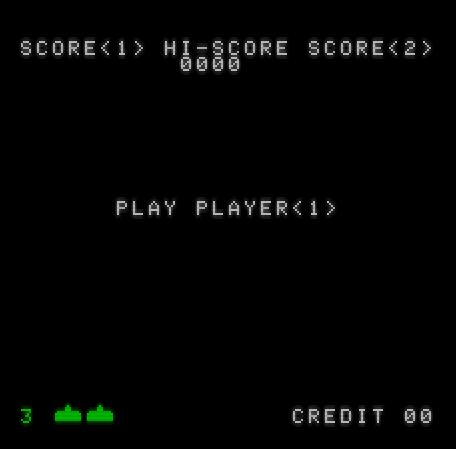

# Space Invaders

A faithful reproduction of the original arcade Space Invaders game, as released in 1978 by Taito. Implemented in Z80 machine code for the ZX Spectrum 48K. 

# Contents

* [game](game) - The game code.
* [building](game/docs/building.md) - How to build the project.
* [running](game/docs/running.md) - How to run the project.
* [screen-lookup-table](screen-lookup-table) - A utility to generate a lookup table to resolve coordinates to the corresponding screen memory address.
* [shift-sprites](shift-sprites) - A utility to generate "pre-shifted" versions of sprite data for efficient rendering.

# Tooling

* [Visual Studio Code](https://code.visualstudio.com/) - IDE.
* [DeZog](https://github.com/maziac/DeZog) - Z80/Spectrum development environment for VSCode. 
* [Sjasmplus](https://github.com/z00m128/sjasmplus) - Z80 Assembler.
* [CSpect](https://mdf200.itch.io/cspect) - ZX Spectrum Emulator. 
* [Gnu Make](https://www.gnu.org/software/make/) - Build tool, native on Linux and ports to Windows are available.

# Status

Most of the major game elements are now in place, though there is significant work remaining.

