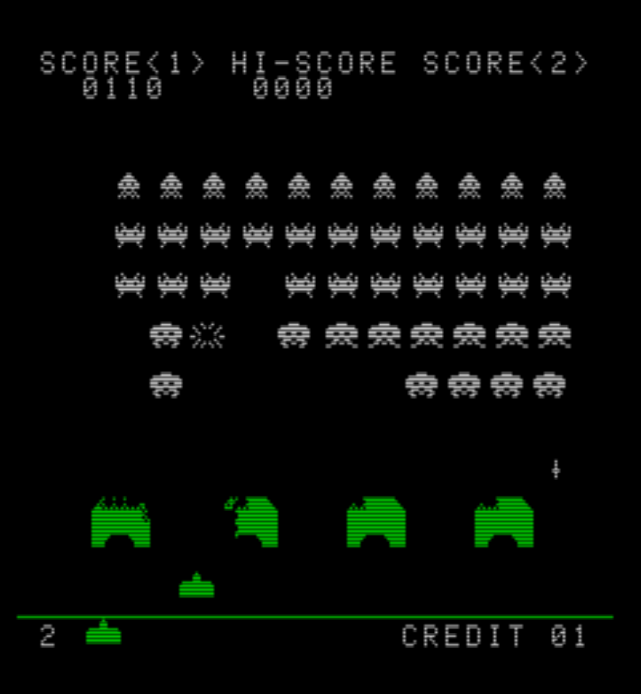
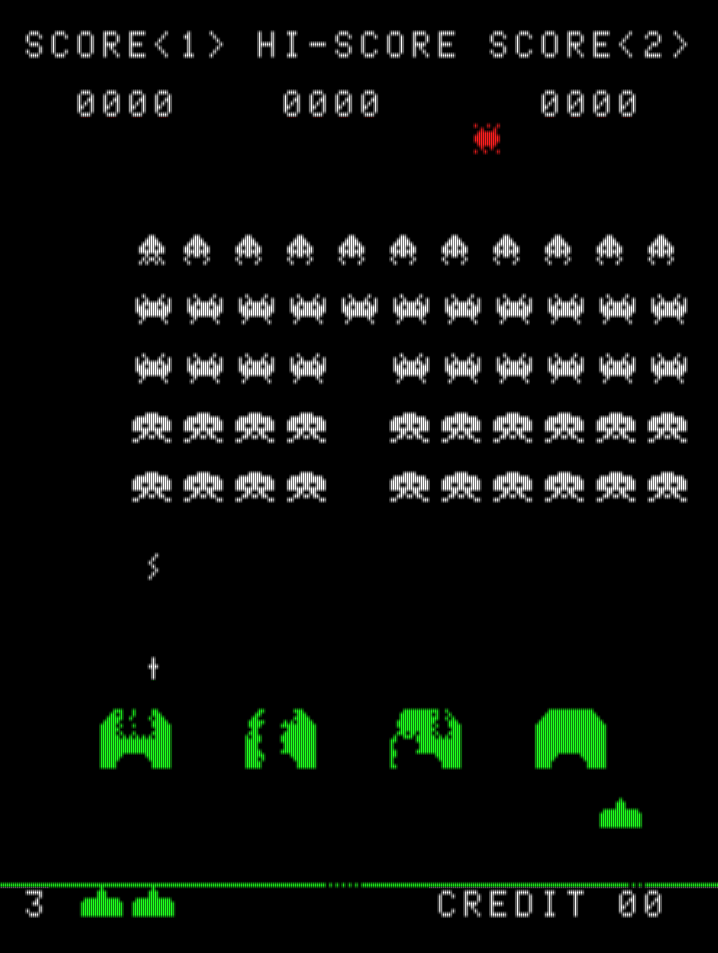
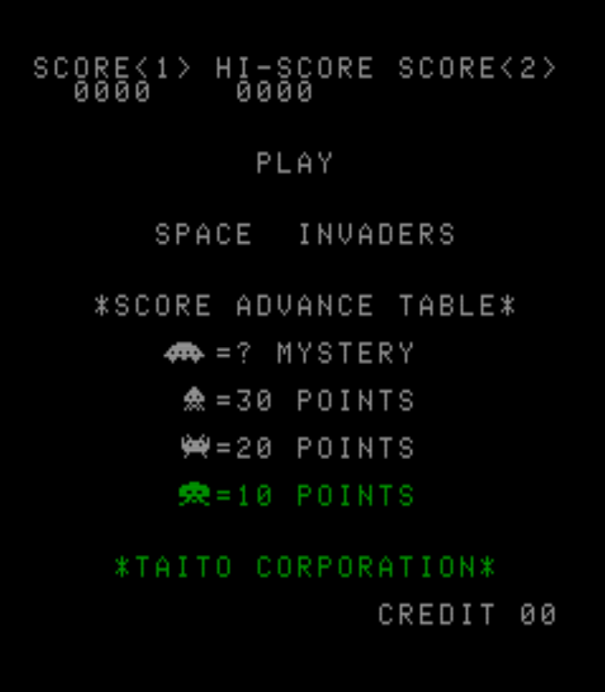
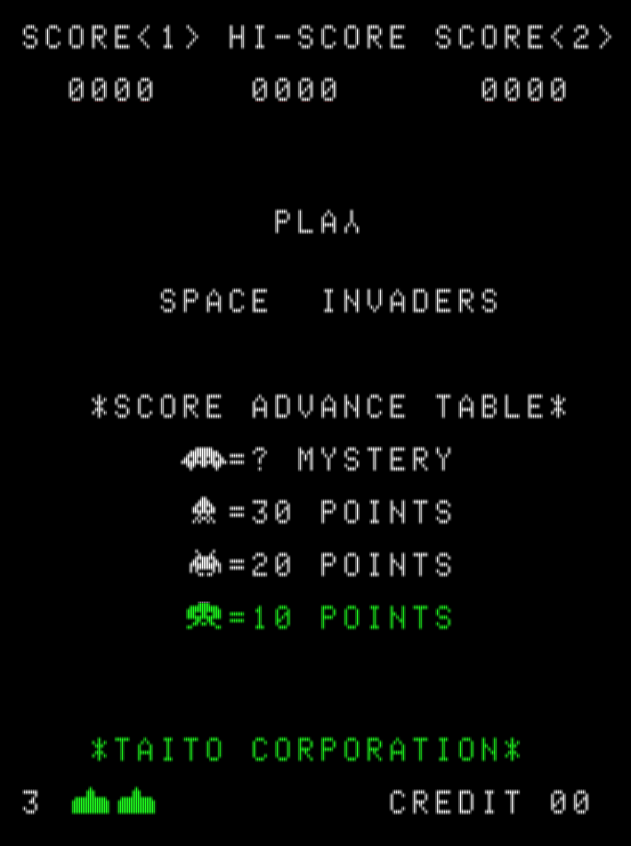
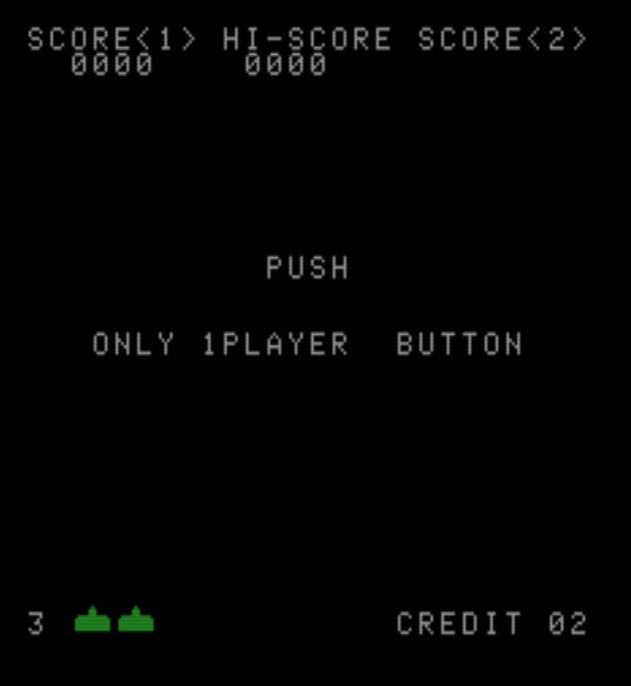
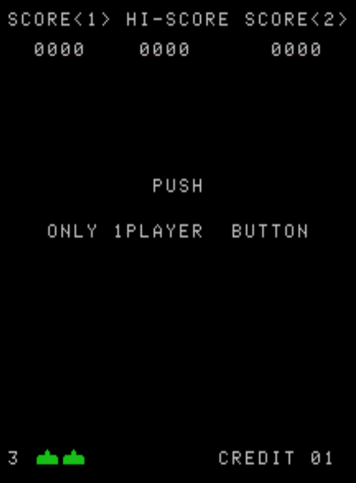
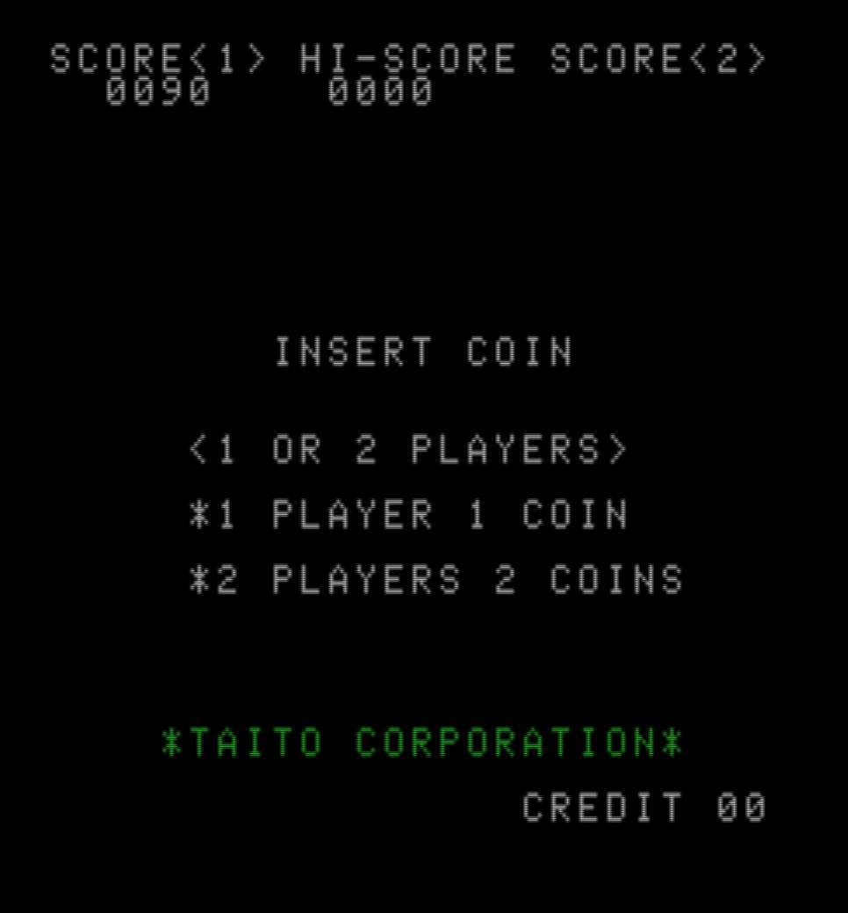
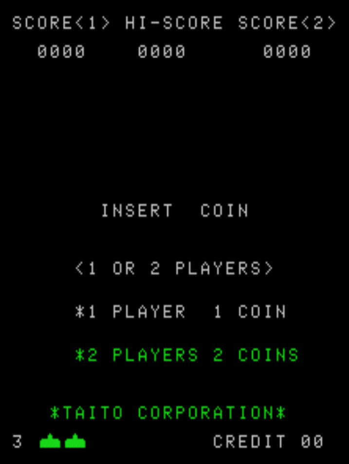

# Screen Shots

This page has side-by-side views of this project running under ZX Spectrum emulation in MAME (*left*) against the original Taito Space Invaders directly emulated in MAME (*right*).

# Game/Demo Play

# Score Table

# Push Player 1

# Insert Coin

